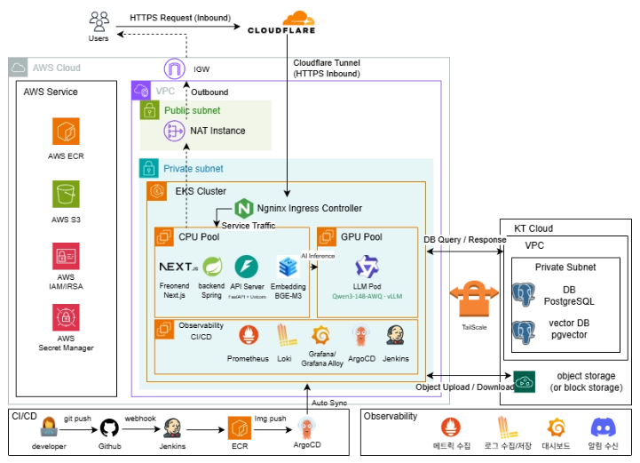

# 클라우드 인프라 아키텍처 설계서

---

## 1. 개요

AWS EKS 애플리케이션 계층과 KT Cloud 데이터 계층으로 구성된 인프라의 **구성요소와 연결 관계**를 정리한 클라우드 인프라 아키텍처 설계서

---

## 2. 전체 아키텍처



### 구성요소

| 구성요소 위치                                   |                                  |
| ----------------------------------------- | -------------------------------- |
| Cloudflare Zone / Tunnel                  | Cloudflare                       |
| NGINX Ingress Controller                  | EKS Cluster                      |
| EKS Control Plane                         | AWS 관리형                          |
| CPU Pool Node                             | Private Subnet                   |
| Observability·CI/CD Pool Node `[협의중]`     | Private Subnet                   |
| GPU Pool Node                             | Private Subnet                   |
| VPC / Subnet / Route Table / IGW          | AWS                              |
| NAT Instance (Tailscale Subnet Router 겸용) | Public Subnet                    |
| ECR / S3 / IAM / Secrets Manager          | AWS                              |
| PostgreSQL                                | KT Cloud                         |
| pgvector `[구성 방식 확정 필요]`                  | KT Cloud                         |
| Object Storage                            | KT Cloud                         |
| Prometheus · Loki · Grafana · Alloy       | Observability·CI/CD Pool `[협의중]` |
| Jenkins · ArgoCD                          | Observability·CI/CD Pool `[협의중]` |

### 워크로드 배치

| Pool 배치 워크로드                           |                                                                                          |
| -------------------------------------- | ---------------------------------------------------------------------------------------- |
| **CPU Pool**                           | Frontend(Next.js), Backend(Spring), API Server(FastAPI + Uvicorn), **Embedding(BGE-M3)** |
| **GPU Pool**                           | LLM Pod (Qwen3-14B-AWQ · vLLM)                                                           |
| **Observability · CI/CD Pool** `[협의중]` | Prometheus, Loki, Grafana / Grafana Alloy, ArgoCD, Jenkins                               |
| Pool 외 (클러스터 레벨)                       | NGINX Ingress Controller                                                                 |

> **Observability·CI/CD Pool 분리 여부** **`[협의중]`** — 초기에는 CPU Pool의 여유 자원을 활용하고, 실제 리소스 사용량과 Jenkins Build 부하를 측정한 뒤 전용 Pool 분리 여부를 결정한다.

### 트래픽 흐름

| # 흐름 경로  |                          |                                                                                    |
| -------- | ------------------------ | ---------------------------------------------------------------------------------- |
| 1        | HTTPS Request            | User → Cloudflare DNS → Cloudflare Tunnel → cloudflared → NGINX Ingress Controller |
| 2        | Service Traffic          | NGINX Ingress → CPU Pool (FE / BE / API Server)                                    |
| 3        | AI Inference             | API Server · Embedding → GPU Pool (LLM Pod)                                        |
| 4        | DB Query / Response      | Backend · API Server → KT Cloud PostgreSQL / pgvector                              |
| 5        | Object Upload / Download | Backend → KT Cloud Object Storage                                                  |
| 6        | Outbound                 | Private Subnet → NAT Instance → 외부                                                 |
| 7        | 배포                       | Developer → GitHub → Jenkins → ECR → ArgoCD → EKS                                  |
| 8        | 백업                       | KT Cloud PostgreSQL / Object Storage → AWS S3                                      |

---

## 3. 네트워크

### 3.1 구조

| 영역 위치 배치       |          |                                           |
| -------------- | -------- | ----------------------------------------- |
| Public Subnet  | AWS VPC  | NAT Instance (Tailscale Subnet Router 겸용) |
| Private Subnet | AWS VPC  | EKS Cluster(전체 Node/Pod)                  |
| Data           | KT Cloud | PostgreSQL, pgvector, Object Storage      |

### 3.2 외부 진입

```
User → Cloudflare DNS → Cloudflare Tunnel (HTTPS Inbound) → cloudflared → NGINX Ingress Controller → Service → Pod

```

**Cloudflare 역할 구분**

| 구성 역할 적용               |                                   |                           |
| ---------------------- | --------------------------------- | ------------------------- |
| Cloudflare DNS         | 도메인 이름 해석, 외부 진입점 연결              | 적용                        |
| Cloudflare Tunnel      | Origin의 인바운드 개방 없이 외부 요청 전달       | 적용                        |
| cloudflared            | 클러스터 내부에서 Cloudflare로 아웃바운드 터널 유지 | 적용 (배치 Pool `[미정]`)       |
| Cloudflare Proxy / WAF | Origin IP 은닉, DDoS·WAF 보호         | `[미정]` — 보안 요구사항·비용 기준 결정 |

| 항목 설계         |                                                         |
| ------------- | ------------------------------------------------------- |
| TLS 종단        | Cloudflare Edge (Origin 구간은 Tunnel 암호화)                 |
| L7 라우팅        | **NGINX Ingress Controller** (현행) / Gateway API 전환 검토 중 |
| 도메인 / 호스트 라우팅 | `[미정]`                                                  |

**ingress-nginx EOL 이슈 — 재검토 진행 중**

`ingress-nginx` 프로젝트의 서비스 종료가 예고되어, `ingress-nginx`로 구현한 후 `Gateway API`, `Istio` 등으로 변경을 검토한다.

| 후보 검토 내용         |                                                        |
| ---------------- | ------------------------------------------------------ |
| NGINX Ingress 유지 | 구축 난이도 낮음. EOL 이후 보안 패치 중단 리스크                         |
| **Gateway API**  | Kubernetes 표준이며 EKS가 지원. 백엔드가 모놀리식이라 적용에 제약 없음. 멘토 권장안 |
| Istio            | Gateway 기능 외에 Sidecar 주입으로 전 워크로드 재배포가 필요해 부담 큼        |

- Gateway API는 **명세이지 구현체가 아니므로**, ALB를 쓰지 않는 현재 구조에서는 클러스터 내부 구현체(Envoy Gateway 등)를 별도로 선정해야 한다. 구현체 선정이 전환 판단의 핵심.

### 3.3 아웃바운드

- 일반 인터넷 아웃바운드는 **NAT Instance** 경유 (NAT Gateway 미사용)
- VPC Endpoint는 NAT 트래픽 측정 후 비용 효과가 큰 대상만 적용
- NAT Instance는 Source/Dest Check 비활성화 필요
- NAT Instance는 SPOF이므로 장애 시 Terraform·Ansible로 재생성

### 3.4 AWS ↔ KT Cloud 연결

| 항목 내용    |                                                     |
| -------- | --------------------------------------------------- |
| 방식       | Tailscale Site-to-Site (양측 Subnet Router가 사설 대역 광고) |
| AWS 측 배치 | **NAT Instance 겸용 (Public Subnet)**                 |
| 허용 통신    | EKS Node 대역 → DB Port, Object Storage 엔드포인트만        |
| 라우팅      | Private Route Table에 KT 대역 → NAT Instance ENI       |

- 전용 EC2를 추가하지 않고 **NAT Instance에 Tailscale Subnet Router를 함께 구성**한다. 성능 저하나 장애 격리가 필요해지면 별도 EC2 분리를 검토한다.
- NAT Instance와 Subnet Router를 겸용하므로 **`ip_forward`****, iptables, 라우팅 설정 충돌 여부를 사전 확인**해야 한다. (KT Cloud 조사 문서와 동기화)
- Source/Dest Check 비활성화 필요
- 겸용 구성에서는 **NAT Instance 장애 시 외부 아웃바운드와 KT Cloud DB 접근이 동시에 중단**된다. 이중화 대신 알림 + 재생성 절차로 대응하되, 장애 영향 범위를 파트 내 공유한다.
- **DB 왕복 지연(RTT) 실측 후 백엔드 파트에 공유** — 낙찰·동시성 로직에 영향
- 현재 아키텍처 도식에는 연결 구간과 KT Cloud 경계가 명시되어 있지 않으므로 도식에 반영 필요

---

## 4. EKS 클러스터

### 4.1 클러스터

| 항목 값        |                |
| ----------- | -------------- |
| 클러스터 수      | 1              |
| 리전 / AZ     | ap-northeast-2 |
| 버전          | `[미정]`         |
| Endpoint 접근 | `[미정]`         |

**필요 애드온**: VPC CNI / CoreDNS / kube-proxy / EBS CSI Driver(PVC용) / Metrics Server / NVIDIA Device Plugin(GPU Pool 도입 시)

### 4.2 Node Pool

| Pool 배치 워크로드 인스턴스 타입             |                                                  |        |
| -------------------------------- | ------------------------------------------------ | ------ |
| CPU Pool                         | Frontend, Backend, API Server, Embedding(BGE-M3) | `[미정]` |
| Observability·CI/CD Pool `[협의중]` | Prometheus, Loki, Grafana/Alloy, Jenkins, ArgoCD | `[미정]` |
| GPU Pool                         | LLM Pod (vLLM)                                   | `[미정]` |

> **Observability·CI/CD Pool** **`[협의중]`** — 전용 Pool 분리는 확정 사항이 아니다. 초기에는 CPU Pool의 여유 자원에서 운영하고, 리소스 사용량과 Jenkins Build 부하를 측정한 뒤 분리 여부를 결정한다.

**배치 제어**

- `nodeSelector` / `nodeAffinity` / `taints·tolerations`로 Pool별 배치 제어
- GPU Pool에 Taint를 부여해 일반 워크로드가 GPU 노드를 점유하지 않도록 함
- 모든 Pod에 `requests` / `limits` 필수 지정 (값은 각 파트 산정)
- 핵심 서비스에 `PriorityClass` 적용

**인스턴스 사양 결정 방법**

- 각 파트의 Pod Request를 합산해 산정한다. Observability·CI/CD 도구는 Prometheus·Loki·Grafana·Jenkins·ArgoCD가 함께 상주하므로 실측 후 배치와 사양을 함께 결정한다.
- **작은 인스턴스 유형에서 시작해 부족할 때 올린다.** 현재 백엔드 파트 요청 사양이 크레딧 여유를 넘어서므로, 실제 사용량 기준으로 하향 조율이 필요하다.

### 4.3 설치 컴포넌트

| 구분 컴포넌트  |                                                                                                        |
| -------- | ------------------------------------------------------------------------------------------------------ |
| 진입       | NGINX Ingress Controller, cloudflared                                                                  |
| 관찰성      | Prometheus, Loki, Alloy, Grafana                                                                       |
| CI/CD    | Jenkins, ArgoCD                                                                                        |
| 시스템      | Metrics Server, EBS CSI Driver, NVIDIA Device Plugin                                                   |
| 확장       | HPA / KEDA / Karpenter — 세부 적용 대상·Threshold·NodePool 정책 `[협의중]`, **GPU Scale-to-Zero는 비용 최적화 원칙으로 확정** |

- LLM 워크로드의 Scale-to-Zero는 GPU 비용 절감의 기본 방향으로 확정한다. 이를 어떤 도구 조합(KEDA / Karpenter)으로 구현할지와 임계값은 부하 측정 후 결정한다.

### 4.4 HA 정책

| 항목 내용                          |                             |
| ------------------------------ | --------------------------- |
| FE / BE / API Server Replica 수 | `[미정]`                      |
| Readiness Probe                | 적용 — 초기화 미완료 Pod로 트래픽 유입 방지 |
| Liveness Probe                 | 적용 — 무응답·교착 Pod 자동 재시작      |
| Startup Probe                  | vLLM 등 초기 로딩이 긴 워크로드에 추가 적용 |
| Rolling Update                 | 기본 적용                       |
| PDB 적용 대상                      | `[미정]`                      |
| Multi-AZ Node 배치 범위            | 비용 및 가용성 요구사항 확인 후 결정       |

---

## 5. AI · GPU 워크로드

| 구성 모델 / 프레임워크 배치  |                      |          |
| ----------------- | -------------------- | -------- |
| LLM               | Qwen3-14B-AWQ + vLLM | GPU Pool |
| Embedding         | BGE-M3               | CPU Pool |
| 오케스트레이션           | FastAPI + Uvicorn    | CPU Pool |

- Embedding이 CPU Pool에 있어 수요 군집화 흐름이 GPU에 의존하지 않으므로, **GPU Pool은 LLM 호출 시점에만 기동**할 수 있다 (Scale-to-Zero 전제)
- vLLM Pod는 모델 로딩 시간이 길어 Startup Probe 필요
- vLLM `/metrics`를 Prometheus 수집 대상에 포함 (AI 파트 요청)

---

## 6. 데이터 계층

| 구성 배치 접근 경로    |                          |                                                 |
| -------------- | ------------------------ | ----------------------------------------------- |
| PostgreSQL     | KT Cloud Private Network | Tailscale S2S, DB Port만 개방                      |
| pgvector       | KT Cloud                 | **KT Cloud PostgreSQL Extension 지원 여부 확인 후 확정** |
| Object Storage | KT Cloud                 | Tailscale S2S                                   |
| 백업             | AWS S3                   | KT Cloud → S3 단방향                               |

- pgvector는 기존 PostgreSQL에 Extension으로 통합하는 방향이나, **KT Cloud DBaaS의 Extension 지원 여부에 따라 구성 방식이 달라진다.** 미지원 시 VM 직접 설치 등 대안을 검토한다. (KT Cloud 조사 문서 연계)
- PostgreSQL은 `pg_dump` 또는 KT Cloud가 지원하는 Backup Export 방식으로 AWS S3에 저장, Object Storage 중요 데이터도 S3에 Secondary Backup
- 백업 주기·보존 기간 `[미정]`

### 크로스 클라우드 지연 리스크

메인 DB를 KT Cloud에 두는 현 구조는 **AWS ↔ KT Cloud 간 왕복 지연이 상시 발생**한다. 역경매 특성상 마감 직전 입찰이 집중되는 구간에서 DB 왕복이 잦아 지연이 서비스 품질에 영향을 줄 수 있다.

- 멘토 의견: 지연은 불가피하므로 **메인 DB는 경량화하고 KT Cloud는 백업·이중화 용도로 쓰는 방향**을 권장
- 현재 방침: **일단 현 구조로 진행**하고, 지연이 서비스에 문제를 일으키는 수준이면 그때 DB 배치를 재검토한다
- 판단 근거 확보: 구축 직후 DB 왕복 지연(RTT)을 실측하고, 부하 테스트 시 마감 시점 동시 입찰 시나리오에서의 응답 지연을 측정해 백엔드 파트와 공유한다

| 재검토 트리거 대응 방향           |                                              |
| ----------------------- | -------------------------------------------- |
| 입찰 집중 구간 응답 지연이 목표치를 초과 | 메인 DB를 AWS로 이전(경량 구성)하고 KT Cloud는 백업 전용으로 전환 |

---

## 7. 클러스터 운영 구성

### IAM

Pod → AWS 접근은 **IRSA**로 처리하고 컨테이너에 장기 Access Key를 주입하지 않는다. 적용 대상은 EBS CSI Driver, Loki(S3 접근), Jenkins Agent(ECR), Secret 조회 컴포넌트. Secret Store는 아키텍처 기준 **AWS Secrets Manager**이며 최종 확정과 운영 방식은 네이밍/Secret 관리 문서를 따른다.

### CI/CD 배치

파이프라인 규칙은 Git 협업 문서. 인프라는 실행 환경만 제공한다.

| 구성 배치 비고           |                                  |                                    |
| ------------------ | -------------------------------- | ---------------------------------- |
| Jenkins Controller | Observability·CI/CD Pool `[협의중]` | PVC 필요, 설정은 코드로 관리 (노드 축소 시 유실 방지) |
| Jenkins Agent      | 동적 Pod                           | 빌드 시에만 기동, 종료 시 소멸                 |
| ArgoCD             | Observability·CI/CD Pool `[협의중]` | Git revert 기반 Rollback을 표준 절차로 함   |
| 이미지                | ECR                              | 이미지 네이밍·푸시 규칙은 Git 협업 문서           |

- GitOps는 타 파트 배포 시마다 규칙 조율이 필요하므로, **인프라 파트가 이미지 네이밍·푸시 디렉토리 규칙을 선제적으로 제시**한다 (Git 협업 문서)
- Jenkins Build 부하는 전용 Pool 분리 여부 판단의 주요 근거이므로 초기 운영 시 사용량을 측정한다

### Observability

| 계층 구성     |                                    |
| --------- | ---------------------------------- |
| Metrics   | Prometheus                         |
| Logs      | Loki + Alloy                       |
| Dashboard | Grafana                            |
| Alert     | Grafana Alerting → Discord Webhook |

- 수집 대상: 노드 지표, 클러스터 상태, 애플리케이션 `/metrics`, vLLM `/metrics`, 컨테이너 로그
- 보존 기간 및 로그 저장 백엔드 `[미정]`
- Prometheus 구축 후, **FE/BE가 필요로 하는 관제 항목을 정리한 문서를 별도 작성**한다 (파트 산출물 후보)

---

## 8. IaC 구성

- Terraform으로 AWS 인프라 전체를 관리한다
- Ansible은 K8s 외부 영역(NAT Instance·Tailscale Subnet Router 부트스트랩, KT Cloud VM 초기 설정)으로 한정한다
- K8s 내부 리소스는 ArgoCD + Helm이 담당하며 Ansible과 역할을 중복시키지 않는다
- 비용 절감을 위한 Destroy를 전제로, **데이터 보존이 필요한 리소스(KT Cloud DB, S3 Backup, Persistent Volume 등)와 Terraform으로 재생성 가능한 인프라(VPC, EKS, NAT Instance 등)를 구분**한다. ECR·IAM 등의 보존 여부는 비용 Runbook에서 별도로 정의한다.
- 디렉토리 구조·모듈 구성·State 관리 방식은 네이밍 규약서를 따른다