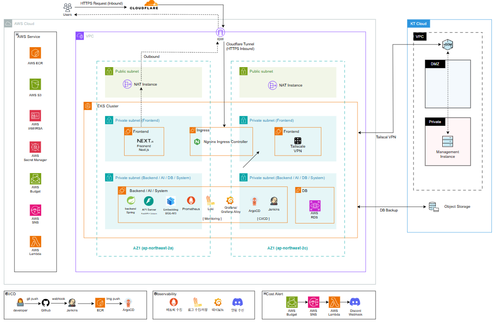

# Cloud Infra Git 협업 Convention & Repository Directory Guide

## 1. 문서 목적

본 문서는 클라우드 인프라 파트에서 Terraform, Kubernetes, Helm, ArgoCD,
Jenkins, Observability 등의 코드와 설정을 공동 관리하기 위한 Git 협업
규칙과 Repository / Directory 작성 기준을 정의한다.

주요 목적은 다음과 같다.

-   여러 팀원의 동시 작업 시 코드 충돌 최소화
-   인프라 변경 이력 추적
-   PR 기반 코드 리뷰 및 변경 검증
-   담당 영역별 코드 관리 기준 통일
-   Terraform IaC 및 ArgoCD GitOps의 재현성 확보
-   잘못된 인프라 변경의 직접 반영 방지

------------------------------------------------------------------------

## 2. Repository 구조

Cloud Infra Repository는 다음 구조를 기준으로 관리한다.

``` text
MoongCheap-Cloud/
├── terraform/
├── gitops/
│   ├── helm/
│   ├── argocd/
│   └── jenkins/
├── docs/
├── .gitignore
└── README.md
```

최상위 Directory는 **`terraform/`(AWS 인프라 프로비저닝)** 과
**`gitops/`(Kubernetes 배포 및 CI/CD)** 두 개로 유지하고, Kubernetes와
CI/CD 관련 구성은 모두 `gitops/` 아래에서 관리한다.

| Directory | 역할 | 담당 |
| --- | --- | --- |
| `terraform/` | AWS / KT Cloud IaC 및 Terraform 관리 | 최상우 / 양재혁 |
| `gitops/` | Helm Chart, ArgoCD Application, Jenkins Pipeline, Observability 등 Kubernetes / CI/CD 구성 전체 | 윤성 / 김준우 / 부학성 |
| `docs/` | Cloud Infra 설계 및 운영 문서 | 공통 |

Observability는 Helm Chart로 배포하고 ArgoCD가 동기화하므로 별도 최상위
Directory를 두지 않고 `gitops/helm/infra/observability/`에서 Chart, Values,
Grafana Dashboard 및 Prometheus Rule을 함께 관리한다.

세부 Directory는 실제 구현 단계에서 필요한 구성요소에 따라 확장한다.

------------------------------------------------------------------------

## 3. Branch 전략

### 3.1 Branch 구조

``` text
main
 │
 ├── develop
 │    ├── feat/*
 │    ├── fix/*
 │    ├── refactor/*
 │    ├── docs/*
 │    ├── test/*
 │    └── chore/*
 │
 └── hotfix/*
```

일반적인 작업은 `develop`을 기준으로 수행한다.

현재 `main` 기준 배포 상태를 긴급하게 수정해야 하는 경우에만
`hotfix/*`를 사용한다.

### 3.2 main

최종적으로 검증된 안정 상태를 관리한다.

-   Demo / Production 배포 기준 Branch
-   직접 Push 금지
-   반드시 Pull Request를 통해 Merge
-   최소 1명 이상의 Review 후 Merge
-   CI 구축 이후 CI 검증 통과 필수
-   Force Push 금지
-   Branch 삭제 금지
-   언제든 배포 가능한 상태 유지

`develop → main` PR은 **양재혁의 최종 Review 및 Merge**를 원칙으로 한다.

### 3.3 develop

클라우드 인프라 파트의 통합 개발 Branch이다.

-   일반 작업 Branch의 기본 Merge 대상
-   직접 Push 금지
-   PR + Review 이후 Merge
-   CI 구축 이후 CI 검증 추가
-   개발 환경 기준 통합 상태 유지

일반적인 작업 흐름:

``` text
develop
   ↓
작업 Branch 생성
   ↓
작업 및 검증
   ↓
PR
   ↓
담당 영역 Review
   ↓
develop
   ↓
통합 검증
   ↓
PR
   ↓
양재혁 Review
   ↓
main
```

### 작업 Branch 생성 방법

Repository를 최초 Clone한 후 일반 작업은 `develop`을 기준으로 작업 Branch를 생성한다.

최초 Clone 시:

```bash
git clone <repository-url>
cd MoongCheap-Cloud

git checkout develop
git pull origin develop
```

이후 새로운 작업을 시작할 때는 항상 로컬 `develop`을 최신 상태로 갱신한 후 작업 Branch를 생성한다.

```bash
git checkout develop
git pull origin develop
git checkout -b <type>/<작업-내용>
```

예:

```bash
git checkout develop
git pull origin develop
git checkout -b feat/terraform-vpc
```

작업 완료 후 변경사항을 Commit하고 작업 Branch를 원격 Repository에 Push한다.

```bash
git add .
git commit -m "feat(vpc): add vpc infrastructure"
git push -u origin feat/terraform-vpc
```

이후 GitHub에서 작업 Branch를 `develop`으로 Merge하는 Pull Request를 생성한다.

```text
feat/terraform-vpc
        ↓
Pull Request
        ↓
담당 영역 Review
        ↓
develop
```

`main` 또는 `develop`에서 직접 작업하거나 직접 Push하지 않는다.

### 3.4 hotfix

현재 `main` 기준으로 배포된 환경에서 즉시 수정해야 하는 문제가 발생했을
때 사용한다.

`hotfix/*`는 `develop`이 아닌 **`main`에서 분기한다.**

``` text
main
 ↓
hotfix/*
 ↓
수정
 ↓
검증 / Review
 ↓
PR
 ↓
main
```

Hotfix 완료 후 변경사항을 반드시 `develop`에도 동기화한다.

``` text
hotfix/* → main
             │
             └────→ develop 동기화
```

이를 통해 이후 `develop → main` Merge 과정에서 Hotfix가 누락되거나
충돌하는 것을 방지한다.

#### fix와 hotfix의 차이

  -----------------------------------------------------------------------
  Branch            분기              Merge             용도
  ----------------- ----------------- ----------------- -----------------
  `fix/*`           `develop`         `develop`         개발 과정에서
                                                        발견된 일반 오류

  `hotfix/*`        `main`            `main` +          현재 배포 버전의
                                      `develop` 동기화  긴급 수정
  -----------------------------------------------------------------------

------------------------------------------------------------------------

## 4. Branch Naming Convention

작업 Branch는 다음 형식을 사용한다.

``` text
<type>/<작업-내용>
```

  Type         용도
  ------------ --------------------------
  `feat`       신규 기능·리소스 추가
  `fix`        개발 중 오류 수정
  `refactor`   기능 변화 없는 구조 개선
  `docs`       문서 변경
  `test`       테스트 및 검증
  `chore`      설정·버전 등 관리 작업
  `hotfix`     배포 상태 긴급 수정

예:

``` text
feat/terraform-vpc
feat/eks-nodegroup
feat/helm-backend

fix/nat-routing
fix/argocd-path

refactor/vpc-module
docs/terraform-guide
test/jenkins-pipeline

hotfix/argocd-sync
```

Branch 이름은 영문 소문자를 사용하며 단어는 `-`로 구분한다.

------------------------------------------------------------------------

## 5. Commit Convention

Conventional Commits 형식을 기반으로 한다.

``` text
<type>(<scope>): <description>
```

예:

``` text
feat(vpc): add private subnet
feat(eks): add managed node group
feat(helm): add backend chart

fix(nat): fix private subnet route
fix(argocd): fix application path

refactor(vpc): separate routing module

docs(terraform): add execution guide

ci(jenkins): add terraform validation
```

### Commit Type

  Type         의미
  ------------ ------------------
  `feat`       신규 기능·리소스
  `fix`        오류 수정
  `refactor`   구조 개선
  `docs`       문서 변경
  `test`       테스트
  `chore`      기타 관리
  `ci`         CI 설정
  `build`      Build 관련 변경
  `revert`     이전 변경 복구

Scope는 변경 영역을 기준으로 작성한다.

``` text
vpc
eks
ecr
iam
s3
nat
rds
elasticache
opensearch
secrets
cloudflare
budget
terraform
gitops
helm
argocd
jenkins
monitoring
backup
docs
ktcloud
```

하나의 Commit에는 가능한 하나의 논리적 변경만 포함한다.

------------------------------------------------------------------------

## 6. Pull Request Convention

`develop`, `main` 변경은 반드시 Pull Request를 통해 진행한다.

PR 제목은 Commit Convention과 동일한 형식을 권장한다.

``` text
feat(vpc): add network infrastructure
fix(eks): fix node group configuration
hotfix(argocd): fix sync configuration
```

### PR Template

``` markdown
## 작업 내용

- 주요 변경 사항

## 변경 이유

- 해당 변경이 필요한 이유

## 영향 범위

- [ ] Terraform / AWS
- [ ] Kubernetes / Helm
- [ ] ArgoCD / CI/CD
- [ ] Observability
- [ ] KT Cloud
- [ ] Documentation

## 검증

- [ ] Local Validation 완료
- [ ] CI 통과
- [ ] 관련 문서 수정

## 참고 사항

- 리뷰어가 확인해야 할 사항
```

Terraform 변경 시:

``` bash
terraform fmt
terraform validate
terraform plan
```

Helm 변경 시:

``` bash
helm lint
helm template
```

------------------------------------------------------------------------

## 7. Review / Merge 규칙

### 7.1 작업 Branch → develop

변경 영역에 따라 담당자가 서로 Review한다.

  변경 영역            담당              Review 원칙
| 변경 영역 | 담당 | Review 원칙 |
| --- | --- | --- |
| `terraform/**` | 최상우 / 양재혁 | 상호 Review |
| `gitops/**` | 윤성 / 김준우 / 부학성 | 상호 Review |

예를 들어:

``` text
최상우
  │
  └─ feat/terraform-vpc
           │
           │ PR
           ▼
        develop
           ▲
           │
       양재혁 Review
```

반대로 양재혁이 `terraform/**`을 변경했다면 최상우가 Review한다.

하나의 PR이 여러 담당 영역을 동시에 변경하는 경우에는 **각 영역 담당자의
확인을 받는 것을 원칙**으로 한다.

`docs/**` 등 공통 영역은 변경 내용과 관련된 담당자가 Review한다.

### 7.2 develop → main

개발 및 통합 검증이 완료된 변경사항은 다음 흐름으로 반영한다.

``` text
develop
   │
   │ Pull Request
   ▼
 main
   ▲
   │
양재혁 Review / Merge
```

-   팀원이 `develop → main` PR 생성
-   양재혁 최종 Review
-   이상이 없을 경우 `main` Merge
-   Demo / Production 기준 상태 갱신

현재 개인 Repository 단계에서는 GitHub Ruleset만으로 담당자별 Review
정책 전체를 강제하지 않고 **팀 협업 규칙으로 운영한다.**

향후 Organization Repository로 이전한 이후에는 Team / Required Reviewer
정책을 적용하여 담당 영역별 Review를 GitHub에서 강제한다.

------------------------------------------------------------------------

## 8. Merge 방식

기본 Merge 방식은 **Squash Merge**를 사용한다.

``` text
feat(vpc): add subnet
fix(vpc): fix cidr
fix(vpc): fix route

        ↓ Squash

feat(vpc): add vpc network infrastructure
```

Merge 완료 후 작업 Branch는 삭제한다.

이를 통해 `develop`, `main`의 Commit History를 작업 단위로 유지한다.

------------------------------------------------------------------------

## 9. Branch Protection / Ruleset

현재 Repository에는 `main`, `develop`을 대상으로 기본 보호 규칙을
적용한다.

### main

``` text
Require Pull Request
Require 1 Approval

Block Force Push
Block Branch Deletion
```

### develop

``` text
Require Pull Request
Require 1 Approval

Block Force Push
Block Branch Deletion
```

CI/CD 구축 이후 다음 항목을 추가한다.

``` text
Require Status Checks
```

이를 통해 Terraform Validation, Helm Validation, Jenkins Pipeline 등의
검증 결과와 Merge 조건을 연동한다.

------------------------------------------------------------------------

## 10. Organization 이전 후 Required Reviewer 정책

Repository를 GitHub Organization으로 이전한 이후에는 담당 영역별 GitHub
Team을 구성하고 Required Reviewer 정책을 적용한다.

목적은 현재 팀 내부 규칙으로 운영하는 담당 영역별 상호 Review 및 `main`
최종 Review를 GitHub 정책으로 강제하는 것이다.

### 10.1 Reviewer Team 구성

| GitHub Team | 구성원 | 담당 영역 |
| --- | --- | --- |
| `terraform-reviewers` | 최상우 / 양재혁 | `terraform/**` |
| `gitops-reviewers` | 윤성 / 김준우 / 부학성 | `gitops/**` |
| `main-reviewers` | 양재혁 | `main` 최종 승인 |

각 Team에는 Repository Review에 필요한 권한을 부여한다.

### 10.2 develop Required Reviewer

`develop` Ruleset에는 변경 Directory에 따라 담당 Team의 승인을
요구하도록 설정한다.

``` text
Target Branch: develop

terraform/**
→ terraform-reviewers
→ Required Approval: 1

gitops/**
→ gitops-reviewers
→ Required Approval: 1
```

목표 Review 구조:

``` text
terraform/**
최상우 작업 → 양재혁 Review
양재혁 작업 → 최상우 Review

gitops/**
윤성 / 김준우 / 부학성 중
작업자 외 1명 Review
```

`develop` Ruleset은 다음 정책을 기준으로 한다.

``` text
Require Pull Request
Require 1 Approval
Require Required Reviewer
Require approval of the most recent reviewable push

Block Force Push
Block Branch Deletion
```

CI/CD 구축 이후에는 다음 항목을 추가한다.

``` text
Require Status Checks
```

### 10.3 main Required Reviewer

`main`은 변경 Directory와 관계없이 **양재혁의 최종 승인**을 요구한다.

``` text
Target Branch: main

Required Reviewer:
→ main-reviewers
→ 양재혁
→ Required Approval: 1
```

전체 흐름:

``` text
작업 Branch
     │
     │ 담당 영역 Reviewer
     ▼
  develop
     │
     │ PR
     ▼
main-reviewers
  양재혁
     │
     ▼
    main
```

`main` Ruleset은 다음 정책을 기준으로 한다.

``` text
Require Pull Request
Require 1 Approval
Require Required Reviewer

Block Force Push
Block Branch Deletion
```

CI/CD 구축 이후에는 다음 항목을 추가한다.

``` text
Require Status Checks
```

### 10.4 CODEOWNERS

Organization 이전 이후 필요한 경우 `.github/CODEOWNERS`를 사용할 수
있다.

다만 본 Repository의 Merge 승인 정책은 **Ruleset의 Required Reviewer를
기준**으로 관리하며, CODEOWNERS는 코드 소유 영역 및 자동 Review 요청을
명시하는 보조 수단으로 사용한다.

예:

``` text
/terraform/                            @organization/terraform-reviewers
/gitops/                               @organization/gitops-reviewers
```

CODEOWNERS 파일은 `main`, `develop`에서 서로 다른 내용으로 관리하지 않고
동일하게 유지한다.

이를 통해 `develop → main` Merge 과정에서 CODEOWNERS 파일 자체가 Branch
간 차이로 발생하는 것을 방지한다.

------------------------------------------------------------------------

## 11. Terraform Directory

Terraform은 재사용 가능한 Module과 환경별 Root Module을 분리한다.

Module 구성은 **네이밍 규약서 4절**을 기준으로 한다.

``` text
terraform/
├── modules/
│   ├── vpc/
│   ├── nat/
│   ├── eks/
│   ├── ecr/
│   ├── iam/
│   ├── rds/
│   ├── s3/
│   ├── secrets/
│   ├── elasticache/
│   ├── opensearch/
│   ├── cloudflare/
│   └── budget-alert/
│
└── envs/
    ├── develop/
    │   ├── backend.tf
    │   ├── providers.tf
    │   ├── main.tf
    │   ├── variables.tf
    │   ├── outputs.tf
    │   └── terraform.tfvars.example
    │
    └── prod/
        └── ...
```

Module 기본 구조:

``` text
terraform/modules/vpc/
├── main.tf
├── variables.tf
├── outputs.tf
└── README.md
```

------------------------------------------------------------------------

## 12. GitOps Directory

Kubernetes 및 CI/CD 관련 설정은 `gitops/`에서 관리한다.

초기에는 단일 Directory로 시작하며 구현에 따라 다음과 같이 확장할 수
있다.

``` text
gitops/
├── helm/
│   ├── frontend/
│   ├── backend/
│   ├── ai/
│   └── infra/
│       ├── jenkins/
│       ├── argocd/
│       ├── ingress/
│       ├── cloudflared/
│       └── observability/
│
├── argocd/
│   ├── develop/
│   └── prod/
│
└── jenkins/
    ├── Jenkinsfile
    ├── pipelines/
    └── scripts/
```

`gitops/helm/`은 Kubernetes에 배포되는 Chart를, `gitops/argocd/`는 해당
Chart를 동기화하는 ArgoCD Application 정의를, `gitops/jenkins/`는 Build
Pipeline 정의를 관리한다.

### Helm

환경별 차이는 Manifest를 복제하기보다 Values를 통해 관리한다.

``` text
gitops/helm/backend/
├── Chart.yaml
├── values.yaml
├── values-develop.yaml
└── templates/
```

Secret 값은 Values에 직접 저장하지 않는다.

### ArgoCD

GitOps 변경 흐름:

``` text
Git 변경
   ↓
PR / Review
   ↓
Merge
   ↓
ArgoCD Sync
   ↓
EKS
```

Rollback은 Git 변경 이력이 남도록 `git revert`를 기본으로 한다.

------------------------------------------------------------------------

## 13. Observability Directory

Observability Stack은 Helm Chart로 배포하고 ArgoCD가 동기화하므로 별도
최상위 Directory를 두지 않고 `gitops/helm/infra/observability/`에서
관리한다.

``` text
gitops/helm/infra/observability/
├── Chart.yaml
├── values.yaml
├── values-develop.yaml
├── dashboards/          # Grafana Dashboard JSON
├── rules/               # Prometheus Alert Rule
└── templates/
```

Prometheus Rule, Grafana Dashboard, Loki 및 Alloy 설정 등도 가능한
범위에서 Git으로 관리한다.

ArgoCD Application(`gitops/argocd/{env}/observability.yaml`)은 위 경로
하나만 참조한다.

------------------------------------------------------------------------

## 14. Documentation Directory

프로젝트 관련 클라우드 인프라 문서는 `docs/`에서 관리한다.

현재 구조:

``` text
docs/
├── cloud-infra-architecture/
│   ├── architecture_v1.png
│   └── architecture_v2.png
├── cloud_infra_architecture.md
├── cloud-infra-git-convention.md
├── cost-estimation.md
├── cost-management-runbook.md
└── naming_convention.md
```

문서 파일명 뒤의 `_V2`, `-v3` 등 버전 표기는 문서 개정 이력을 구분하기
위한 것이므로 본 Convention에서는 버전 번호까지 고정하지 않는다. 실제
파일은 최신 버전 표기를 포함한 이름을 사용한다.

문서에서 사용하는 이미지 등 별도 리소스는 해당 문서와 연관된 Directory를
생성하여 관리할 수 있다.

예:

``` markdown

```

------------------------------------------------------------------------

## 15. Git 제외 대상

다음 정보는 Repository에 Commit하지 않는다.

``` text
*.tfstate
*.tfstate.*
.terraform/

*.tfvars
!*.tfvars.example

.env
.env.*

*.pem
*.key

kubeconfig
credentials
```

또한 다음과 같은 Secret 정보는 어떠한 형태로도 Repository에 저장하지
않는다.

``` text
AWS Access Key
AWS Secret Access Key

DB Password
API Token
Webhook Secret
```

Terraform의 `.terraform.lock.hcl`은 일반적으로 **Commit하여 Provider
버전을 일관되게 유지**한다.

------------------------------------------------------------------------

## 16. Cloud Infra 작업 Workflow

### 일반 변경

``` text
Issue / 작업 할당
        ↓
develop 최신화
        ↓
작업 Branch 생성
        ↓
코드 작성
        ↓
Local Validation
        ↓
Commit / Push
        ↓
Pull Request
        ↓
담당 영역 Review
        ↓
develop Merge
        ↓
개발 환경 통합 검증
        ↓
develop → main PR
        ↓
양재혁 Review
        ↓
main Merge
```

### 긴급 변경

``` text
운영 / Demo 장애
       ↓
main 최신화
       ↓
hotfix/* 생성
       ↓
수정
       ↓
검증 / Review
       ↓
main PR
       ↓
main Merge / 배포
       ↓
develop 동기화
```

------------------------------------------------------------------------

## 17. 핵심 협업 원칙

1.  `main`, `develop` 직접 Push 금지
2.  일반 작업은 `develop`에서 분기
3.  `terraform/**`은 최상우 ↔ 양재혁 상호 Review
4.  `gitops/**`는 윤성 / 김준우 / 부학성 상호 Review
5.  `develop → main`은 양재혁 최종 Review
6.  긴급 수정은 `main → hotfix/*`
7.  Hotfix 완료 후 반드시 `develop` 동기화
8.  하나의 Branch에는 하나의 작업 목적
9.  작은 PR 지향
10. Secret Commit 금지
11. 변경 이유와 영향 범위를 PR에 기록
12. 코드와 관련 문서를 함께 최신화
13. CI/CD 구축 이후 Status Check를 Merge 조건에 추가
14. Organization 이전 후 담당 영역별 Required Reviewer 정책을 적용하여
    Review 규칙을 GitHub에서 강제

> **작업 Branch에서 변경하고 담당 영역별 Review를 거쳐 `develop`에
> 통합하며, 검증된 상태만 `main`에 반영한다.**
